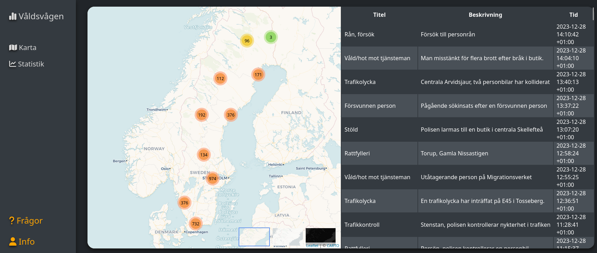

# ValdsVagenFrontend

_A website ([hosted here](https://pommee.github.io/ValdsVagenFrontend/)) that collects data from the swedish police and presents some statistics._

## Usage

**Currently** there is...
* A map to view where crimes occur.
* Table indicating what type of crime, description and timestamp.
* Statistics of...  
    * Crimes this year.
    * Most crime-filled city.
    * Most common crime type.
* Listview of how many times a type of crime occurs.
* Line shart showing the flow of crime rates. This differs from month to month.
* What time of day and how many crimes each hour.

## How to Contribute to the Project

I am a solo developer doing this for fun. But if you feel like contributing, then open a ticket or send me a message.